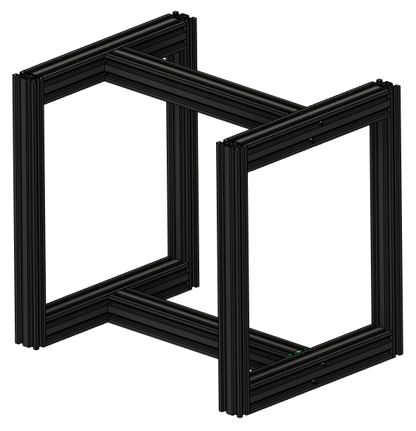
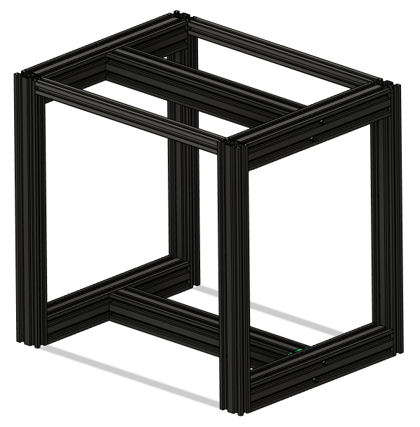

# 🐼 Baby-Panda
## Introduction
Baby Panda is a core-XY printer with conveyor build plate to enable continuous printing. The motion system is borrowed from the [Voron 2.4](https://vorondesign.com/voron2.4). The design is intended to repurpose as many parts as possible from a pair of Ender 3s.

## Building Baby Panda
There are currently no build instructions specific to Baby Panda, so but the [Voron 2.4r2 assembly manual](https://github.com/VoronDesign/Voron-2/raw/Voron2.4/Manual/Assembly_Manual_2.4r2.pdf) can be used for the most part, along with the following reasources for the Baby Panda-specific parts:
* [BOM](https://github.com/robwaldhauser/Baby-Panda/blob/main/BOM%20Spreadsheet.ods) - Baby Panda bill of materials (.ods format)
* [STLs](https://github.com/robwaldhauser/Baby-Panda/tree/main/STLs) - model files for each part
* [CAD](https://github.com/robwaldhauser/Baby-Panda/tree/main/CAD) - An archive containing a .step file with a fully assembled Baby Panda

If you have any questions, or want to see pictures and videos of builds, check out the #🐼baby-panda channel in the [Build Biome Discord server](https://discord.gg/SpCVg9wG). 

### The Frame
The standard Baby Panda frame can be built entirely from extrusions salvaged from 2 Ender 3s. Ender 3 pro is ideal. 3V2 can work, but the Y extrusion is slightly shorter. This can be worked around using spacers or by buying a longer extrusion.

<em>Standard frame</em>

In the standard configuration, the 3 4040 extrusions from the base of one Ender form the base of the Baby Panda frame, and the base extrusions of the other Ender  form the top. The uprights from each ender, which will need to be drilled out for blind joints using the [jig](https://github.com/robwaldhauser/Baby-Panda/blob/main/STLs/Drilling%20Jig.stl) available in the CAD section, connect the top of the frame to the bottom in each corner.

If desired, for additional rigidity and/or to facilitate enclosure of the printer, 2 additional 2020 extrusions can be purchased and installed in either of the following configurations:

<em>Standard frame with extra 2020</em>

<em>Standard frame with 2020s replacing top 4040</em>

